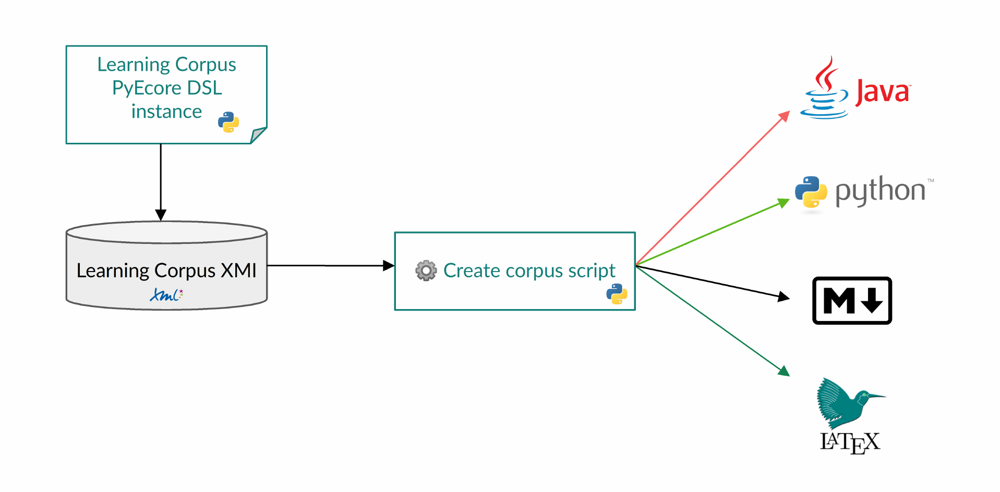

# Modeling Assistant Learning Corpus DSL

## Authors

[Younes Boubekeur](https://github.com/YounesB-McGill),
[Prabhsimran Singh](https://github.com/Prabhsimran-Singh),
[Gunter Mussbacher](https://github.com/gmussbacher/)

## About

A **Modeling Assistant** is a learning tool that teaches how to design software models,
e.g., domain models and state machines. It works by asking students to construct a
model given a problem description in natural language and providing feedback when it
detects mistakes in the student solution. A UI mockup is shown below.


The mistake types and their corresponding feedbacks are defined in a
**Learning Corpus** (LC), which is the main subject of this repository. To define the LC
in a simple and intuitive way, we propose a novel internal DSL based on Python and
[PyEcore](https://pyecore.readthedocs.io/en/latest/index.html). We also provide
sample model transformations to Java, Markdown, and LaTeX.

A research paper covering this DSL and model transformations was submitted to the
[MODELS 2022 Conference](https://conf.researchr.org/home/models-2022) under the name
_[A DSL and Model Transformations to Specify Learning Corpora for Modeling Assistants](https://doi.org/10.1145/3550356.3556502)_
(link will be active in November 2022).

### Other related publications

- Boubekeur and Mussbacher. 2020. [Towards a Better Understanding of Interactions with a Domain Modeling Assistant](https://doi.org/10.1145/3417990.3418742)
- Boubekeur. 2022. A Learning Corpus and Feedback Mechanism for a Domain Modeling Assistant. Master’s thesis
- Singh. 2022. Domain Modeling Mistake Detection System. Master’s thesis
- Schöttle, Thimmegowda, Alam, Kienzle, and Mussbacher. 2015.
  [Feature Modelling and Traceability for Concern-Driven Software Development with TouchCORE](https://doi.org/10.1145/2735386.2735922)

## Setup Instructions

### Prerequisites

* Python 3.10 or higher
* The [`pipenv`](https://pipenv.pypa.io/) package manager (`pip install --user pipenv`),
  which is used to manage Python dependencies

### Setup

#### Python Environment

**One-time setup:** In the repo root, run `pipenv install` to install dependencies.

**To run Python scripts in this repo:** First activate the Python environment. This can be done in an IDE like
Visual Studio Code or by running `pipenv shell` in the terminal. Then run the desired script from the repo root.

Commonly run commands:

```bash
pytest  # This runs all tests for the Python app
python modelingassistant/pythonapp/flaskapp.py  # Run the Modeling Assistant Feedback Mechanism backend
python modelingassistant/pythonapp/createcorpus.py  # Updates LC from corpus definition file (DSL)
```

## Learning Corpus Overview

The LC for a software language consists of mistake types sorted into categories.
Each mistake type has at least four levels of feedback, which are given to the student
one at a time until they resolve the mistake. The common pattern for feedback levels is:

1. Highlight a student element or problem statement element depending on the mistake type.
   Examples of both are shown in the image above
2. Give the student a hint in the form of a text response
3. Send the student a parametrized response, which contains context-specific information
   about the mistake. More on this below
4. Response(s) with learning resource, such as an example or quiz
5. Reference resource response, where a reference to the textbook or lecture notes
   is provided as a final level of feedback

The main and quiz LC metamodels can be found in the
[`modelingassistant/model`](modelingassistant/model) folder in various formats.

A sample human-readable LC is provided in the
[`corpus_descriptions`](modelingassistant/corpus_descriptions) folder.
The learning resources are taken from the teaching materials used by Prof Mussbacher
and are adapted in part from the
[textbook](https://www.site.uottawa.ca/school/research/lloseng/) by Lethbridge and Laganière.

## Learning Corpus DSL

### DSL Overview

#### Mistake Types and Categories

* `mtc()`: shorthand for the `MistakeTypeCategory` initializer
* `mt()`: shorthand for the `MistakeType` initializer, with these additional parameters:
  * `n`: the short name of the mistake type used internally (e.g., “Assoc should be enum PR pattern”)
  * `d`: the description used in user-facing contexts and in documentation (e.g., “Association should
    be enumeration Player-Role pattern”)
  * `stud` and `inst`: the student and instructor mistake elements, respectively, both of which can
    be a single element, e.g., `"attr"`, or a list of elements, e.g., `["sub_cls", "super_cls"]`
    (the mistake elements using the `ParametrizedResponse` grammar described below)
  * `stud_inst`: if `stud` and `inst` are identical, `stud_inst` can be used instead of them
  * `fbs()`: creates the feedbacks for the mistake type given a dictionary with the level as the key and
    the `Feedback`(s) as the value, as shown in the example below

#### Parametrized Responses

The grammar for the parameters of each parametrized response is as follows.


* `description`: a string that provides more information about the parameter, e.g., `super` in
  `inst_super_cls`, and which is required whenever there is more than one parameter with the same
  person (student or instructor) and the same type
* `elementtype` refers to a metatype shorthand as defined in the
  [`metatypes.py`](modelingassistant/pythonapp/metatypes.py) file, e.g., `cls*`, `compos`
* `elementproperty` is a feature (attribute or reference) defined on an element at the
  metamodel level or a predefined shorthand for it. The shorthands for the TouchCORE class diagram
  [metamodel](https://bitbucket.org/mcgillram/touchram/src/master/ca.mcgill.sel.classdiagram/model/)
  we use are defined as follows:
  * `cls`: the item's `Classifier`
  * `end`: indexed `AssociationEnd`, e.g., `end0` for the item's zeroth association end
  * `opposite`: the opposite end of an `AssociationEnd`
  * `refcls`: get the class that an `AssociationEnd` is referring to instead of its
    containing class

##### Examples

* `stud_attr`: student attribute
* `stud_attr.cls`: the class that contains the student attribute
* `inst_sub_cls`: instructor subclass
* `inst_assoc.end1.cls`: the class that contains End 1 of the instructor association

For more examples, see the [`corpus_definition.py`](modelingassistant/pythonapp/corpus_definition.py) file.

#### Quizzes

* `fitb()`: shorthand for `FillInTheBlanksQuiz` initializer
  * `prompt`: the introductory text for the quiz
  * `statements`: What the student is expected to complete. To specify the blank(s), enclose them in
    curly braces, e.g., `"The capital of Canada is {Ottawa}."`, which will be shown to the student as 
    "The capital of Canada is ______."
* `mcq`: get a `ListMultipleChoiceQuiz` from a sequence of items, as shown for the `attr_naming_quiz`
  in the [`corpus_definition.py`](modelingassistant/pythonapp/corpus_definition.py#L72) file
* `tmcq`: get a `TableMultipleChoiceQuiz` from a grid of items, as shown for the `attr_naming_quiz`
  in the [`statemachinelearningcorpusexample.py`](modelingassistant/pythonapp/statemachinelearningcorpusexample.py#L59) file

### Learning Corpus Entry Creation Process

These are the steps to create a new learning corpus entry, corresponding to a mistake type.

#### Step 1: Update Corpus Definition

The learning corpus is currently defined in the
[`default.learningcorpus`](modelingassistant/learningcorpusinstances/default.learningcorpus) file
based on what is specified in the [`corpus_definition.py`](modelingassistant/pythonapp/corpus_definition.py) file.

1. Using the DSL described above, add a new mistake type (mt) to the corpus definition file in the
   correct mistake type category (mtc), or add a new category. Use the appropriately named helper functions for
   this (`mt` and `mtc`), and add at least one feedback:

   ```python
   missing_class := mt(n="Missing class", stud=[], inst="cls", feedbacks=fbs({
      1: HighlightProblem(),  # Highlight entire sentence. Can infer this from level
      2: TextResponse(text="Make sure you have modeled all the classes in the problem description."),
      3: HighlightProblem(),  # Highlight problem statement element(s) directly referring to the class
      4: ParametrizedResponse(text="Remember to add the ${inst_cls} class."),
      5: ResourceResponse(learningResources=[class_ref := Reference(content="Please review the "
          "[Classes](https://mycourses2.mcgill.ca/) part of the Class Diagram lecture.")]),
   })),
   ```

   Note that `missing_class` is a variable which must match the lowercase name (`n`) of the mistake type,
   with spaces and dashes replaced by underscores. Also note the `:=` (used to define the named expression)
   and the trailing commas.
   Use `stud` and `inst` to specify the student and instructor mistake elements, or `stud_inst` to specify
   both at once. The shorthands in this example, e.g., `cls`, are defined in the
   [`metatypes.py`](modelingassistant/pythonapp/metatypes.py) file.

2. Add the mistake type to the priority list in the corpus definition file.
   Higher mistake types have higher priority.

#### Step 2: Update Learning Corpus Instance

To update the learning corpus instance stored on disk, as well as the Java and Python code,
run the following command:

```bash
python modelingassistant/pythonapp/createcorpus.py
```

#### Step 3: Update Application Source Code

Update the application logic to correctly handle the new mistake type, as needed.

#### Step 4: Run tests

Run all the tests and ensure that all tests that were passing continue to pass.

## Model Transformations

It is possible to transform the LC into various other formats using the
[`createcorpus.py`](modelingassistant/pythonapp/createcorpus.py) script.
We have implemented transformations to
[Python](modelingassistant/pythonapp/mistaketypes.py),
[Java](modelingassistant/corpus_descriptions/MistakeTypes.java),
[Markdown](modelingassistant/corpus_descriptions/README.md), and
[LaTeX](modelingassistant/corpus_descriptions/learningcorpusdefs.tex).


