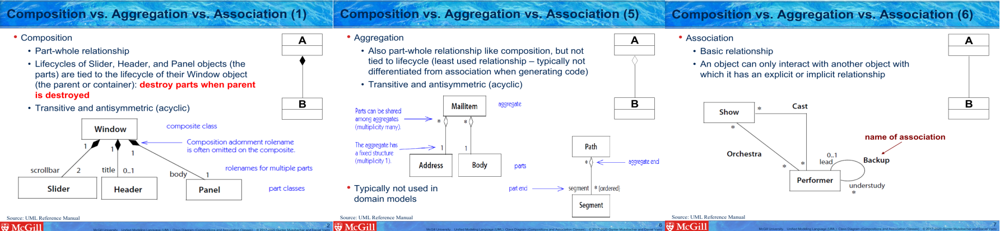
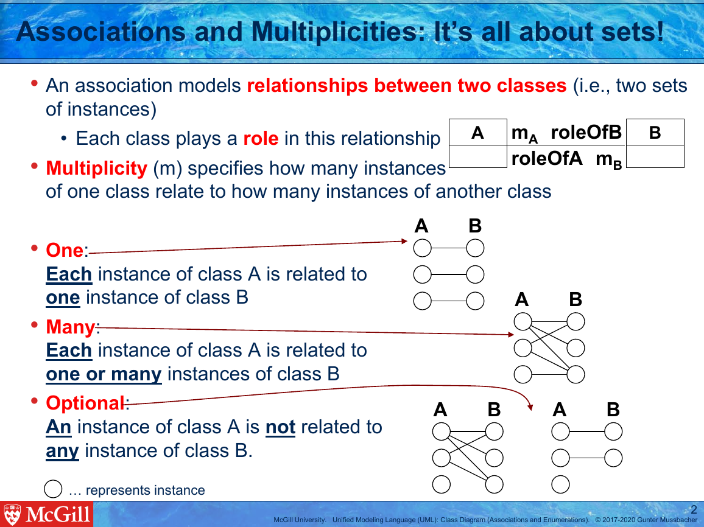
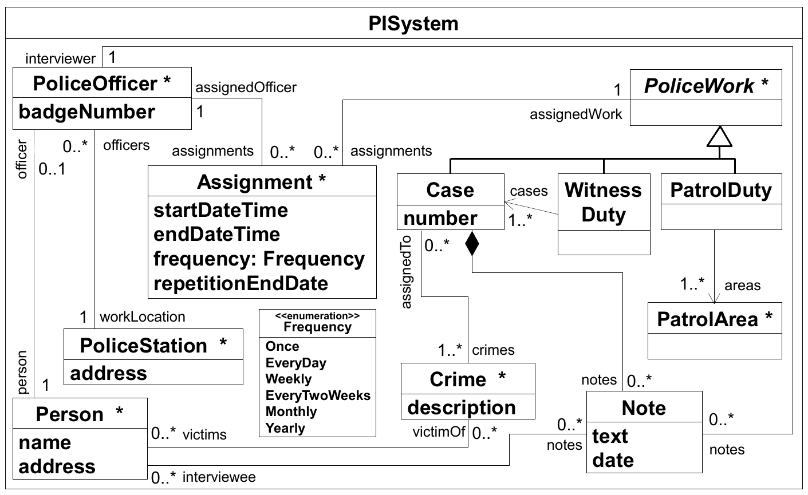
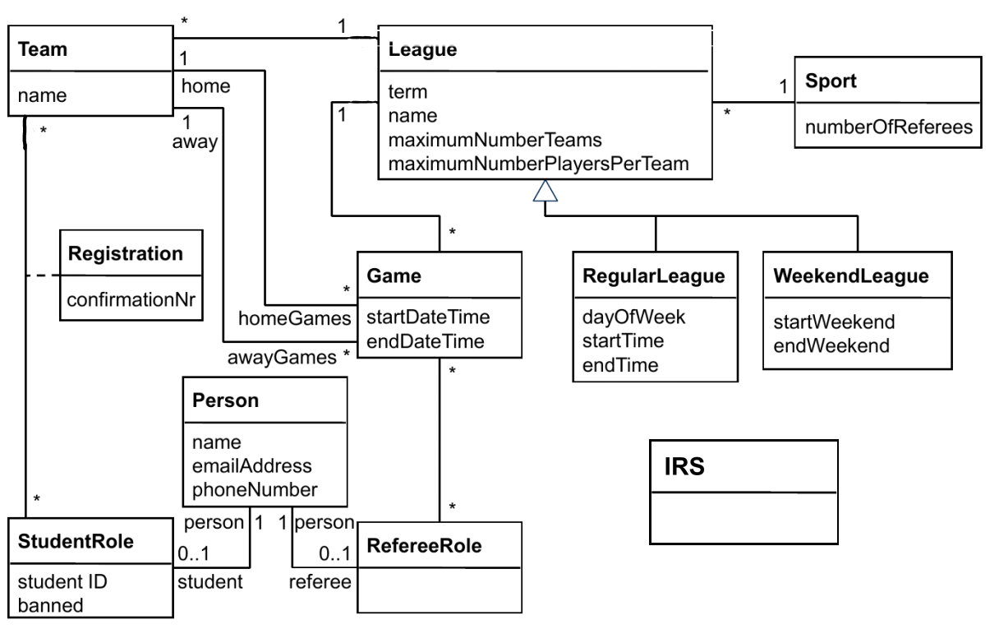
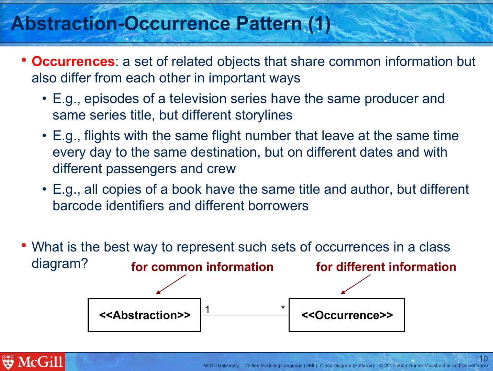

1. [Class mistakes](#class-mistakes)
   1. [Class name mistakes](#class-name-mistakes)
      1. [Plural class name](#plural-class-name)
      1. [Software engineering term](#software-engineering-term)
   1. [Missing class](#missing-class)

1. [Attribute mistakes](#attribute-mistakes)
   1. [Attribute name mistakes](#attribute-name-mistakes)
      1. [Bad attribute name spelling](#bad-attribute-name-spelling)
   1. [Attribute in wrong class mistakes](#attribute-in-wrong-class-mistakes)
      1. [Attribute misplaced](#attribute-misplaced)
   1. [Extra attribute mistakes](#extra-attribute-mistakes)
      1. [Plural attribute](#plural-attribute)

1. [Relationship mistakes](#relationship-mistakes)
   1. [Missing association/aggregation mistakes](#missing-association-aggregation-mistakes)
      1. [Missing association](#missing-association)
      1. [Using attribute instead of association](#using-attribute-instead-of-association)
   1. [Multiplicity mistakes](#multiplicity-mistakes)
      1. [Wrong multiplicity](#wrong-multiplicity)
   1. [Role name mistakes](#role-name-mistakes)
      1. [Missing role name](#missing-role-name)
      1. [Wrong role name but correct association](#wrong-role-name-but-correct-association)
   1. [Composition mistakes](#composition-mistakes)
      1. [Incomplete containment tree](#incomplete-containment-tree)
   1. [Generalization mistakes](#generalization-mistakes)
      1. [Missing generalization](#missing-generalization)

1. [Design pattern mistakes](#design-pattern-mistakes)
   1. [Abstraction-Occurrence pattern mistakes](#abstraction-occurrence-pattern-mistakes)
      1. [Missing Abstraction-Occurrence pattern](#missing-abstraction-occurrence-pattern)

## Class mistakes

### Class name mistakes

#### Plural class name

Student element: Class. Instructor element: Class.

Level 1: Highlight solution

Level 2: Text response:

> Remember that class names should be singular.

Level 3: Parametrized response:

> ${stud_cls} should be ${inst_cls}, using the singular.

Level 4: Resource response with Example:

> Please note these examples of correct vs incorrect class naming:
> :x: Examples to avoid | :heavy_check_mark: Good class names
> --- | ---
> pilot | Pilot
> Airplanes | Airplane 
> AirlineData | Airline

Level 5: Resource response with Reference:

> Please review the [Classes](https://mycourses2.mcgill.ca/) part of the Class Diagram lecture.

#### Software engineering term

Student element: Class. Instructor element: Class.

Level 1: Highlight solution

Level 2: Text response:

> Remember that a domain model should not contain software engineering terms.

Level 3: Parametrized response:

> ${stud_cls} contains a software engineering term (e.g., data, database, table, record), which does not belong in a domain model.

Level 4: Resource response with Example:

> Please note these examples of correct vs incorrect class naming:
> :x: Examples to avoid | :heavy_check_mark: Good class names
> --- | ---
> pilot | Pilot
> Airplanes | Airplane 
> AirlineData | Airline

Level 5: Resource response with Reference:

> Please review the [Classes](https://mycourses2.mcgill.ca/) part of the Class Diagram lecture.

### Missing class

Instructor element: Class.

Level 1: Highlight sentence(s) in problem statement referring to the instructor element

Level 2: Text response:

> Make sure you have modeled all the classes in the problem description.

Level 3: Highlight specific problem statement elements referring to the instructor element

Level 4: Parametrized response:

> Remember to add the ${inst_cls} class.

Level 5: Resource response with Reference:

> Please review the [Classes](https://mycourses2.mcgill.ca/) part of the Class Diagram lecture.

## Attribute mistakes

### Attribute name mistakes

#### Bad attribute name spelling

Student element: Attribute. Instructor element: Attribute.

Level 1: Highlight solution

Level 2: Text response:

> Double check this attribute name.

Level 3: Parametrized response:

> The ${stud_attr.cls}.${stud_attr} attribute is misspelled.[ Use the same spelling as the problem description.]

Level 4: Resource response with List multiple-choice quiz:

Select all the correct attribute names from the list below.

- [ ] needsReciept
- [x] numberOfItems
- [ ] ID
- [ ] numItems
- [ ] Name
- [x] identifier

Level 5: Resource response with Reference:

> Please review the [Attribute](https://mycourses2.mcgill.ca/) and [Noun Analysis](https://mycourses2.mcgill.ca/) parts of the Class Diagram lecture.

### Attribute in wrong class mistakes

#### Attribute misplaced

Student element: Attribute. Instructor element: Attribute.

Level 1: Highlight solution

Level 2: Text response:

> Can you think of a better place for this attribute?

Level 3: Parametrized response:

> The ${stud_attr} attribute does not belong in the ${stud_attr.cls} class. Where else can we place it?

Level 4: Parametrized response:

> The ${stud_attr} attribute belongs in the ${inst_attr.cls} class.

Level 5: Resource response with Reference:

> Please review the [Attribute](https://mycourses2.mcgill.ca/) and [Noun Analysis](https://mycourses2.mcgill.ca/) parts of the Class Diagram lecture.

### Extra attribute mistakes

#### Plural attribute

Student element: Attribute. Instructor element: Attribute.

Level 1: Highlight solution

Level 2: Text response:

> Double check this attribute name.

Level 3: Parametrized response:

> The ${stud_attr.cls}.${stud_attr} attribute should be singular.

Level 4: Resource response with List multiple-choice quiz:

Pick the classes which are modeled correctly with Umple.

- [ ] class Student { courses; }
- [ ] class Folder { List<File> files; }
- [x] class Restaurant { 1 -- * Employee; }

Level 5: Resource response with Reference:

> Please review the [Attribute](https://mycourses2.mcgill.ca/) and [Noun Analysis](https://mycourses2.mcgill.ca/) parts of the Class Diagram lecture.

## Relationship mistakes

### Missing association/aggregation mistakes

#### Missing association

Instructor element: Association.

Level 1: Highlight sentence(s) in problem statement referring to the instructor element

Level 2: Text response:

> How should this relationship be modeled?

Level 3: Parametrized response:

> How would you capture the relationship between ${inst_assoc.end0.cls} and ${inst_assoc.end1.cls}?

Level 4: Resource response with Reference:

> Please review the _Composition vs. Aggregation vs. Association_ section of 
the [UML Class Diagram lecture slides](https://mycourses2.mcgill.ca/) to 
better understand these relationships and where they are used.

#### Using attribute instead of association

Student element: Attribute. Instructor element: Association end.

Level 1: Highlight solution

Level 2: Text response:

> Remember that attributes are simple pieces of data.

Level 3: Parametrized response:

> ${stud_attr} should be its own class.

Level 4: Resource response with List multiple-choice quiz:

Pick the class(es) modeled correctly in Umple.

- [ ] class BankAccount { Client client; }
- [x] class BankAccount { * -- 1..2 Client clients; }; class Client {}
- [ ] class BankAccount { 1..2 -- * Client clients; }; class Client {}
- [ ] class Loan { libraryPatron; }

Level 5: Resource response with Reference:

> Please review the _Composition vs. Aggregation vs. Association_ section of 
the [UML Class Diagram lecture slides](https://mycourses2.mcgill.ca/) to 
better understand these relationships and where they are used.

### Multiplicity mistakes

#### Wrong multiplicity

Student element: Association end. Instructor element: Association end.

Level 1: Highlight solution

Level 2: Text response:

> Double check this association.

Level 3: Text response:

> The multiplicity for this association end is incorrect.

Level 4: Parametrized response:

> How many ${stud_assocend.opposite.cls} instances does a ${stud_assocend.cls} have?

Level 5: Resource response with List multiple-choice quiz:

Pick the association(s) with correct multiplicities:

- [ ] 1 EmployeeRole -- 1 Person;
- [x] * Episode -- 1 TvSeries;
- [ ] * Bank -- 1 Client;
- [ ] * Client -- 1 BankAccount;
- [x] 0..2 Loan -- 1 Client;
- [ ] * Person -- 1 EmployeeRole;
- [x] * EmployeeRole -- 1 Person;

Level 6: Resource response with Reference:

> Please review the [multiplicities](https://mycourses2.mcgill.ca/) part of the Class Diagram lecture.

### Role name mistakes

#### Missing role name

Student element: Association end. Instructor element: Association end.

Level 1: Highlight solution

Level 2: Text response:

> Can you model this relationship more precisely?

Level 3: Parametrized response:

> The relationship between ${stud_assocend.cls} and ${stud_assocend.opposite.cls} is missing a role name.

Level 4: Resource response with Reference:

> Can you think of appropriate [role names](https://mycourses2.mcgill.ca/)
for this relationship? Role names help identify the role a class plays in a
relationship and are particularly important if there is more than one relationship
between the same two classes.

#### Wrong role name but correct association

Student element: Attribute. 

Level 1: Highlight solution

Level 2: Text response:

> Double check this role name.

Level 3: Parametrized response:

> The ${stud_assocend} role name is not correct.

Level 4: Parametrized response:

> The ${stud_assocend} role name should be changed to ${inst_assocend}.

Level 5: Resource response with Reference:

> Can you think of appropriate [role names](https://mycourses2.mcgill.ca/)
for this relationship? Role names help identify the role a class plays in a
relationship and are particularly important if there is more than one relationship
between the same two classes.

### Composition mistakes

#### Incomplete containment tree

Student element: Classes. 

Level 1: Highlight solution

Level 2: Text response:

> Please double-check the relationships of these classes.

Level 3: Parametrized response:

> ${stud_cls*} should be contained in the containment tree.[ Use composition for this.]

Level 4: Resource response with Example:

> Observe the following domain model. Every single class except the root class is directly or
indirectly contained in the root class, `PISystem`.

Level 5: Resource response with List multiple-choice quiz:

Which of the following compositions should be part of the containment tree for the following
model?

- [x] 1 IRS <@>- * StudentRole
- [x] 1 IRS <@>- * Person
- [ ] 1 IRS <@>- * Game
- [x] 1 IRS <@>- * League
- [ ] 1 IRS <@>- * RegularLeague

Level 6: Resource response with Reference:

> Please review the _Composition vs. Aggregation vs. Association_ section of 
the [UML Class Diagram lecture slides](https://mycourses2.mcgill.ca/) to 
better understand these relationships and where they are used.

### Generalization mistakes

#### Missing generalization

Instructor elements: Subclass, Superclass.

Level 1: Highlight sentence(s) in problem statement referring to the instructor element(s)

Level 2: Text response:

> What is the relationship between these classes?

Level 3: Parametrized response:

> A ${inst_sub_cls} is a ${inst_super_cls}. How should we model this?

Level 4: Resource response with Fill-in-the-blanks quiz:

Place the following classes in an inheritance hierarchy: Vehicle, Wheel, LuxuryBus, Airplane, Car, Driver, LandVehicle, Bus. Only use a term once.

* SportsCar isA <ins>Car</ins>
* <ins>Wheel</ins> isA VehiclePart
* Truck isA <ins>LandVehicle</ins>
* AmphibiousVehicle isA <ins>Vehicle</ins>
* <ins>LuxuryBus</ins> isA BusVehicle

Level 5: Resource response with Reference:

> Please review the [Generalization](https://mycourses2.mcgill.ca/) part of the Class Diagram lecture.

## Design pattern mistakes

### Abstraction-Occurrence pattern mistakes

#### Missing Abstraction-Occurrence pattern

Instructor elements: Abstraction class, Occurrence class.

Level 1: Highlight sentence(s) in problem statement referring to the instructor element(s)

Level 2: Text response:

> Think carefully about how to model the relationship between these concepts.

Level 3: Parametrized response:

> The concepts of ${inst_abs_cls} and ${inst_occ_cls} and the relationship between them should be modeled with the Abstraction-Occurrence pattern.

Level 4: Resource response with Reference:

> The [Abstraction-Occurrence Pattern](https://mycourses2.mcgill.ca/) can be used to 
represent a set of related objects that share common information but also differ
from each other in an important way.

